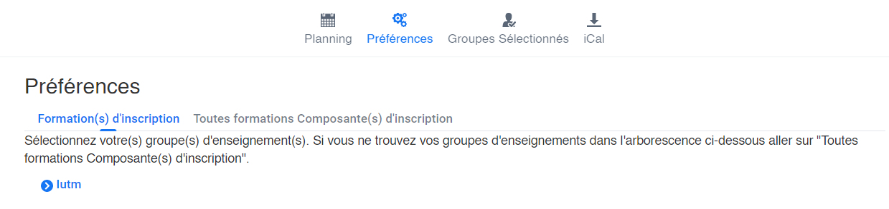
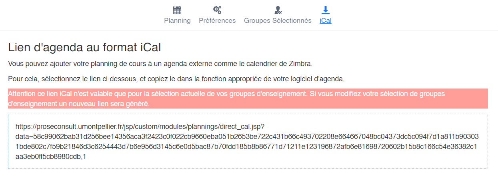

#       **EDT**

# Présentation 
Ce bot permet d'obtenir votre emploi du temps d'étudiant du jour avec un simple lien iCal.

[*Cliquez ici pour l'inviter sur votre serveur !*](https://discord.com/api/oauth2/authorize?client_id=798576179929284649&permissions=8&scope=bot)

# Comment obtenir votre emploi du temps avec ce bot ?
## Première étape : récupérer le lien iCal de votre emploi du temps

1. Pour les étudiant de l'UM : rendez vous sur l'ENT > Planning 20-21.

2. Sélectionnez votre(s) groupe(s) d'enseignement(s) dans l'onglet Préférences.

  

3. Rendez vous dans l'onglet iCal et sélectionnez le lien présent.

  

Attention ce lien iCal n'est valable que pour la sélection actuelle de vos groupes d'enseignement.
Si vous modifiez votre sélection de groupes d'enseignement il faudra associer le nouveau lien iCal au bot

## Deuxième étape : lier le lien iCal au bot discord

Pour ce faire éxécuter commande `?linkICal {lien iCal}`

## Troisième étape : demander son emploi du temps de la journée

Pour cela il faut éxécuter la commande `?today`

## Finish !!

### Voici les différentes commandes d'*EDT* :
- `?linkICal {lien iCal}` : lier le bot avec votre EDT personnel.
- `?helpICal` : avoir des information sur l'obtention du lien iCal
- `?today` : obtenir votre emploi du temps du jour.
- `?help` : aperçu des commandes.

# Pour les développeurs :

N'hésiter pas à parciper au développement de ce bot en forkant ce répo et en réalisant des pulls requests.
De nombreuse choses restes à faire :

- Ajout de fonctionnalitées
- Correction de bugs
- Ect

<u>Le token du bot doit se trouver dans un fichier txt nommé **token.txt** qui doit se trouver lui même dans le même répertoire que **main.py**</u>

